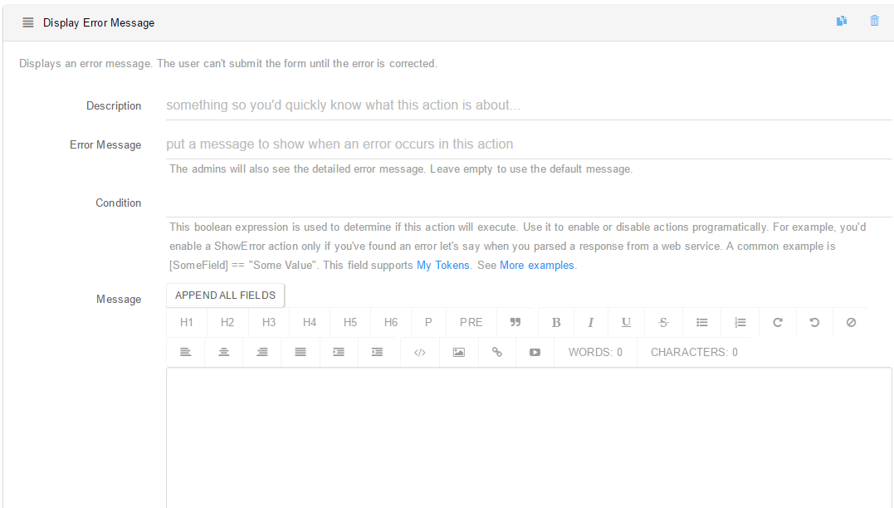

# Display Error Message

This action displays a message if there are some errors while the user is trying to submit the form. It's similar to Display Message action except that you cannot add a button. This action, along with Display Message, can also be used on the section "On Validation Failed". Here's what you can configure:

* **Description**. A short description for the action. Only admins will be able to see this field.
* **Error Message**. An error message that will be displayed in case if a error occurs in this action.
* **Condition**. This boolean expression is used to determine if this action will execute. Use it to enable or disable actions programatically. For example, you'd enable a **ShowError** action only if you've found an error let's say when you parsed a response from a web service. A common example is **[SomeField] == "Some Value"**. This field supports **My Tokens**. 
* **EntryId**. A guid that uniquely identifies an entry. Can contain form tokens (for example **[Email]**) and **My Tokens**.
* **Message**. Can contain form tokens (for example **[Email]**) and **My Tokens**.

