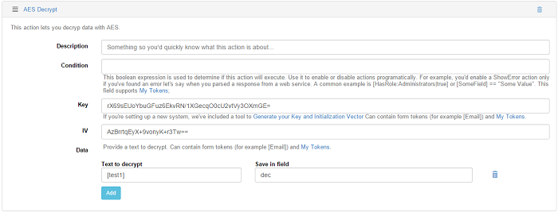
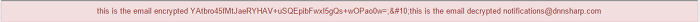

# Security

## AES Decrypt

As additional step to the steps provided on AES Encrypt section, you can decrypt the same field which was previously encrypted by adding the AES Decrypt as second action and setting the same Key and IV as the ones used into the AES Encrypt action but on Data Text to Encrypt you just have to use the token where you've previously saved the data, in our case, [test1].

And here's how the grid item will look encrypted and decrypted: 

## RSA Encrypt and RSA Decrypt

The RSA Encrypt and RSA Decrypt actions can be used in the same way as the AES actions but the only difference consists in the fact that you'll need to use the Public and Private generated keys, the Public key for encrypting and the Private key for decrypting.
