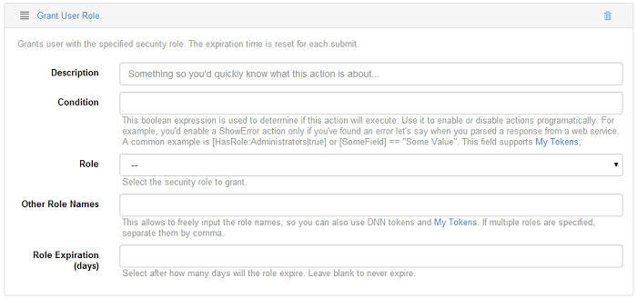
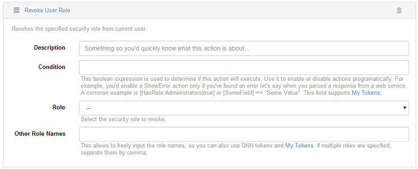
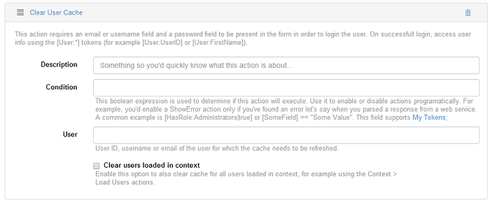

# User

In the "*User*" tree, you have the following actions: User Login, User Registration, Update User Profile, Grant User Role, Revoke User Role, Clear User Cache.

## 

## 

## Grant User Role

Action Grid allows you to assign additional roles to the user as well as to apply an expired date to each role. Grant User Role options:
Role

This option allows you to grant a security role. Select one from the drop down list.
Other Role Names
This option gives you the possibility to input a role name and if you specify multiple role names, separate them by comma. It also accepts DNN tokens and My Tokens.
Role expiration
In this field you can input after how many days the role expires. It you leave it blank, it will never expire.

## Revoke User Role

This action is used with the purpose to revoke the specified security role from the current user.

## Clear User Cache

This action requires an email or username field and a password field to be present in the fields which are linked to the action in order to login the user. On successful login, access user info using the [User:*] tokens (for example [User:UserID] or [User:FirstName]).

